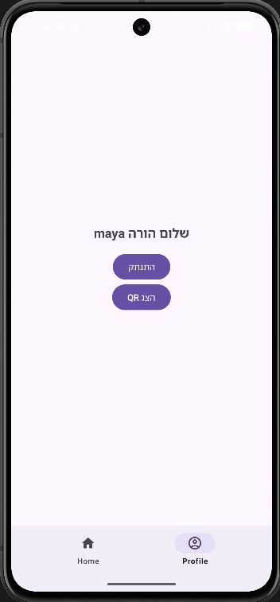
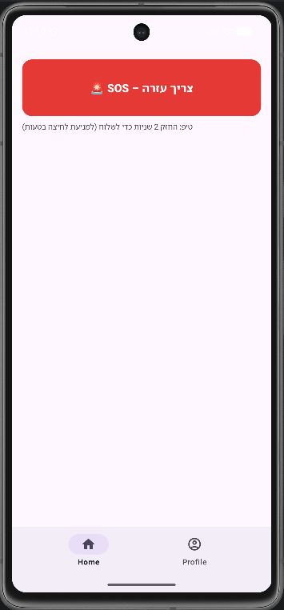
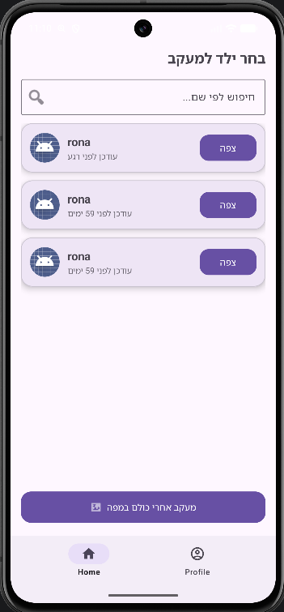
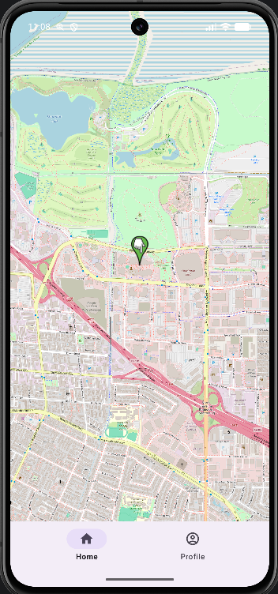
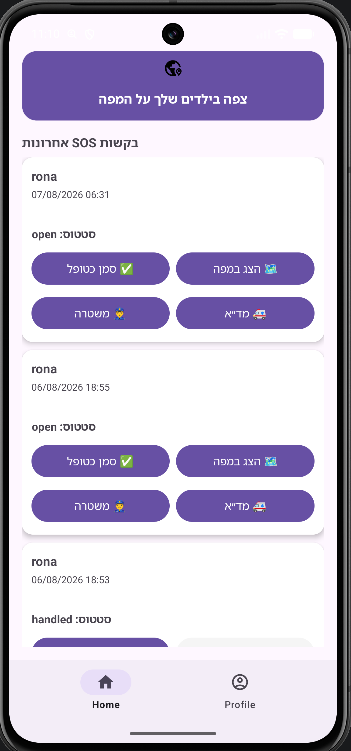
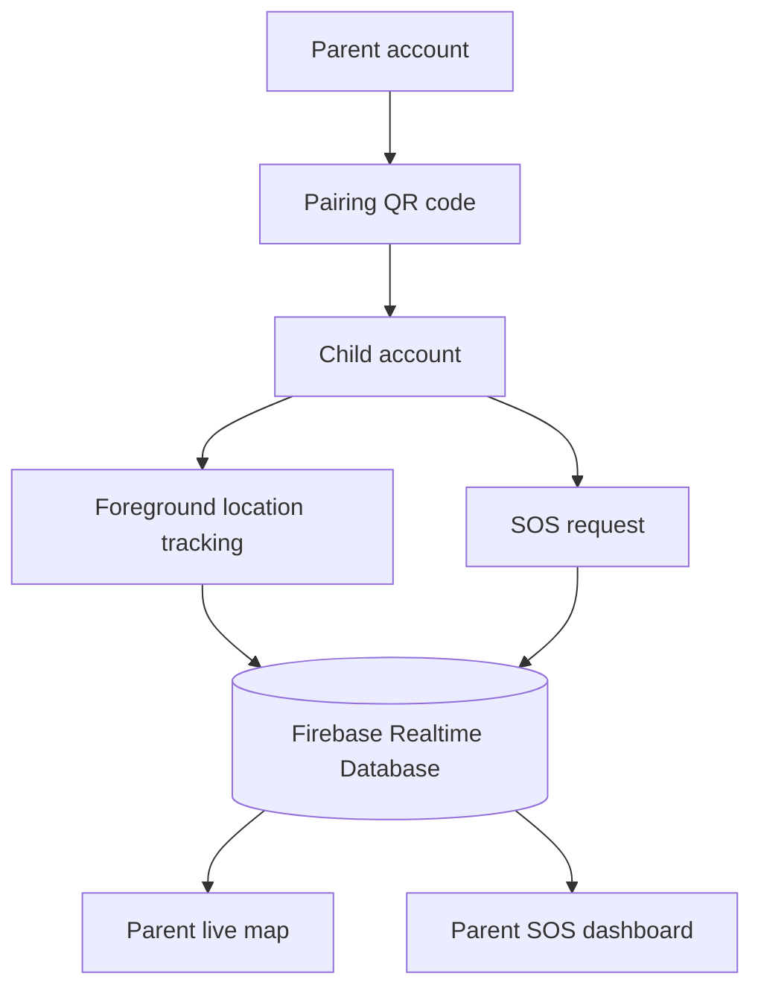

<p align="center">
  
</p>

<h1 align="center">Find My Kid</h1>

<p align="center">
  A family-safety Android application that connects parents and children through live location sharing, QR-based pairing and SOS alerts.
</p>

<p align="center">
  
  
  
  
</p>

---

## About the project

Find My Kid is a native Android application designed to help parents stay connected with their children. A parent and child create separate role-based accounts, pair securely using a parent QR code, and then use the app for background location sharing and emergency communication.

The project demonstrates a complete mobile flow built with Android, Firebase Authentication, Firebase Realtime Database, foreground services, device location, QR scanning and an interactive map.

> The current user interface is in Hebrew.

## Main features

| Parent experience | Child experience |
|---|---|
| Create a parent account and display a pairing QR code | Register as a child by scanning the parent's QR code |
| View one child or all linked children on a live map | Share location through a foreground tracking service |
| Follow realtime location updates from Firebase | Send an SOS request by holding the emergency button |
| Review recent SOS requests and mark them as handled | Attach the latest known location and an optional note to an SOS |
| Open an SOS location directly on the map | Parent verification is required before signing out |
| Launch external navigation with Waze or Google Maps | Continue location updates while the tracking service is active |
| Open the phone dialer for police or MDA assistance | Receive clear permission and tracking feedback in the app |

## Screenshots

<table>
  <tr>
    <td align="center" width="50%">
      <br />
      <sub><b>Parent profile</b></sub>
    </td>
    <td align="center" width="50%">
      <br />
      <sub><b>Child emergency screen</b></sub>
    </td>
  </tr>
</table>

<table>
  <tr>
    <td align="center" width="33%">
      <br />
      <sub><b>Child selection</b></sub>
    </td>
    <td align="center" width="33%">
      <br />
      <sub><b>Live location map</b></sub>
    </td>
    <td align="center" width="33%">
      <br />
      <sub><b>SOS dashboard</b></sub>
    </td>
  </tr>
</table>

## How it works



1. The parent registers and opens the QR code from the profile screen.
2. The child selects the child role and scans that QR code during registration.
3. The relationship is stored in Firebase under the parent and child records.
4. After location permission is granted, the child's foreground service uploads location updates.
5. The parent selects a child—or all linked children—and sees their current positions on the map.
6. When the child sends an SOS, the parent sees the request, its location, note and handling status.

## Technology stack

| Area | Technology |
|---|---|
| Mobile platform | Native Android |
| Language | Java, with Kotlin Gradle DSL for build configuration |
| UI | XML layouts, Material Components, RecyclerView and Android Navigation |
| Authentication | Firebase Authentication with email and password |
| Data | Firebase Realtime Database |
| Location | Google Play Services Fused Location Provider |
| Maps | OSMDroid with OpenStreetMap tiles |
| QR pairing | ZXing Android Embedded |
| Background work | Android foreground services |
| Build | Gradle 8.13 and Android Gradle Plugin 8.13.2 |

## Data model

The application keeps authentication and realtime app data separate. Firebase Authentication manages credentials, while Realtime Database stores the user role, parent-child relationships, current locations and SOS requests.

```text
users/
  {uid}/
    email
    nickname
    uid
    userType

parents/
  {parentUid}/
    childrenUids/
      {childUid}: true
    notificationsEnabled

children/
  {childUid}/
    parentUid

locations/
  {childUid}/
    latitude
    longitude
    timestamp

helpRequests/
  {parentUid}/
    {childUid}/
      {requestId}/
        childName
        latitude
        longitude
        note
        status
        timestamp
```

## Project structure

```text
FindMyKid-Android/
├── app/
│   └── src/main/
│       ├── java/com/example/whereismychildapp/
│       │   ├── Adapters/       # RecyclerView adapters
│       │   ├── Objects/        # User, Parent, Child and HelpRequest models
│       │   ├── Services/       # Location, SOS and foreground services
│       │   ├── MainActivity.java
│       │   └── fragment_*.java # Authentication, profile, home and map screens
│       └── res/
│           ├── layout/         # XML screen and item layouts
│           ├── navigation/     # Navigation graph
│           └── drawable/       # Icons and UI resources
├── Functions/                  # Firebase Cloud Functions workspace
├── gradle/                     # Gradle wrapper and version catalog
└── build.gradle.kts
```

## Android permissions

| Permission | Why it is used |
|---|---|
| Internet | Firebase synchronization and map tiles |
| Fine and coarse location | Obtain the child's device location |
| Background location | Continue tracking when the app is not in the foreground |
| Foreground service | Keep location tracking and SOS monitoring visible to the user |
| Notifications | Display foreground-service and SOS notifications |
| Vibration | Draw attention to urgent SOS notifications |

## Getting started

### Prerequisites

- Android Studio with JDK 17 or later
- Android SDK 36
- An Android device or emulator running API 24 or later
- A Firebase project

### 1. Clone the repository

```bash
git clone https://github.com/mayabargig/FindMyKid-Android.git
cd FindMyKid-Android
```

### 2. Configure Firebase

1. Create a Firebase project and add an Android application with the package name:

   ```text
   com.example.whereismychildapp
   ```

2. Enable **Email/Password** under Firebase Authentication.
3. Create a **Realtime Database**.
4. Download your Firebase `google-services.json` file.
5. Place it at:

   ```text
   app/google-services.json
   ```

6. Configure Realtime Database Security Rules for the parent-child access model before using real data.

> Do not use open test-mode database rules in production, and never commit Firebase Admin SDK credentials or service-account files.

### 3. Build and run

Open the project in Android Studio, allow Gradle to sync, select a device and run the `app` configuration.

You can also build the debug APK from the terminal:

```bash
./gradlew assembleDebug
```

On Windows PowerShell:

```powershell
.\gradlew.bat assembleDebug
```

## Suggested demo flow

For the full experience, use two devices or emulators:

1. On device A, register a **parent** account.
2. Open the parent profile and display the QR code.
3. On device B, register a **child** account and scan the QR code.
4. Grant location and notification permissions on the child device.
5. Open the parent map and select the linked child.
6. Hold the SOS button on the child device for two seconds.
7. Return to the parent home screen to review the new request and open its location.

## Privacy and safety

This is an educational project that processes sensitive location and family-linking data. Before adapting it for production use, add thoroughly tested Realtime Database Security Rules, consent and privacy flows, data-retention controls, abuse prevention, encrypted local storage where needed, and a formal security review.

The SOS and emergency shortcuts support communication but are not a replacement for professional emergency services.

## Author

Developed by [Maya Bargig](https://github.com/mayabargig).
